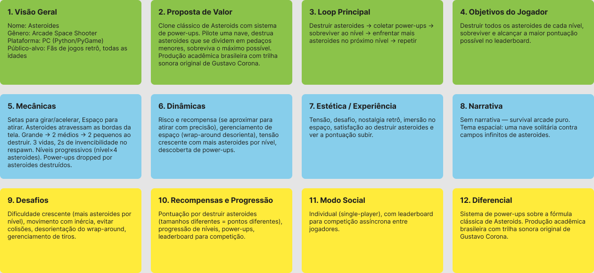

# Documentação Asteroides

## Canvas

## Explicação

### Lógica central do jogo

Asteroides é um space shooter arcade inspirado no clássico da Atari de 1979. O jogador controla uma nave num campo aberto cheio de asteroides e precisa destruir tudo enquanto sobrevive. A cada nível surgem mais asteroides, então a dificuldade só cresce. A grande diferença aqui é o sistema de power-ups, que dá um tempero estratégico a mais numa fórmula que já é clássica.

### Como funciona o loop principal

O loop é simples: destruir asteroides, coletar power-ups, limpar o nível, encarar mais asteroides no próximo e repetir.

O jogador gira e acelera a nave com as setas, atira com a barra de espaço e tem que desviar dos asteroides. Cada asteroide grande que é destruído vira dois médios, e cada médio vira dois pequenos. Quando a tela fica limpa, começa o próximo nível — com mais asteroides que o anterior. E assim o desafio vai subindo.

### Como as mecânicas sustentam os objetivos

- **Movimento com inércia e wrap-around**: exige planejamento, porque não dá pra frear na hora. Isso cria um desafio real de controle e posicionamento.
- **Divisão dos asteroides**: cada um que você destrói vira alvos menores e mais rápidos. Mais pontos, mas também mais perigo.
- **Vidas e invencibilidade temporária**: o jogador pode errar até 3 vezes, e depois de cada respawn ganha um respiro antes de voltar ao perigo. Isso equilibra frustração com desafio.
- **Power-ups**: dão vantagens temporárias pra ajudar a encarar níveis mais difíceis. Criam aquele dilema de se expor pra pegar o power-up ou jogar seguro.
- **Leaderboard**: transforma pontuação em objetivo de longo prazo — sempre dá vontade de tentar de novo pra bater o próprio recorde.

### Experiência que o jogo busca

- **Tensão**: a dificuldade crescente e o movimento imprevisível dos asteroides mantêm o jogador ligado o tempo todo.
- **Desafio**: controlar a nave com inércia e lidar com o wrap-around exige adaptação constante.
- **Nostalgia retrô**: a estética arcade remete direto aos fliperamas.
- **Satisfação**: destruir asteroides, ver a pontuação subir e passar de nível dão aquele feedback positivo na hora.
- **Imersão**: o tema espacial, a trilha e os efeitos sonoros ajudam a criar atmosfera.

### Por que tudo se encaixa

O público-alvo (fãs de jogos retrô) explica a escolha do gênero arcade e da estética visual. O loop principal — destruir, coletar, sobreviver, repetir — é sustentado pelas mecânicas de tiro, movimento e divisão dos asteroides. As dinâmicas de risco e recompensa, e a tensão crescente, nascem naturalmente da forma como o jogador interage com os níveis progressivos. Os desafios (dificuldade crescente, inércia, wrap-around) têm resposta direta nas recompensas (pontuação, power-ups, progressão). O modo social — single-player com leaderboard — complementa bem a natureza arcade, trazendo competição sem tirar o foco da experiência individual. E o diferencial, power-ups mais trilha sonora original, agrega valor sem descaracterizar a fórmula original.

No fim, o projeto forma um ciclo coeso: cada peça reforça a outra e o resultado é uma experiência fiel ao gênero arcade, mas com identidade própria.

---

## Mini GDD

### 1. Título do jogo

**Asteroides**

### 2. Resumo do jogo

Asteroides é um space shooter arcade feito em Pygame, inspirado no clássico da Atari de 1979. O jogador controla uma nave num campo aberto cheio de asteroides, destruindo-os e desviando de colisões enquanto avança por níveis cada vez mais difíceis. O projeto acrescenta um sistema de power-ups à fórmula original, trazendo uma camada estratégica extra, além de uma trilha sonora própria que reforça o clima espacial.

### 3. Público-alvo

Fãs de jogos retrô e arcade que curtem mecânicas simples mas desafiadoras. Também funciona bem pra jogadores casuais que querem uma experiência rápida, sem curva de aprendizado.

### 4. Objetivo do jogador

Destruir todos os asteroides de cada nível e sobreviver o máximo possível, acumulando pontos. Não existe um fim definitivo — o objetivo é bater seus próprios recordes e disputar posição no leaderboard.

### 5. Core gameplay / loop principal

Destruir asteroides → coletar power-ups → limpar o nível → encarar mais asteroides → repetir.

A cada nível, o número de asteroides aumenta e a dificuldade sobe junto. O jogador precisa equilibrar ataque (destruir) e defesa (desviar) pra sobreviver e pontuar.

### 6. Mecânicas principais

- **Movimento com inércia e wrap-around**: a nave acelera, sofre atrito e tem velocidade máxima. Ao sair de um lado da tela, reaparece do outro — vale pra nave, asteroides e projéteis.
- **Tiro**: dispara na direção que a nave está apontando, com um intervalo mínimo entre disparos.
- **Divisão dos asteroides**: cada asteroide grande vira dois médios, cada médio vira dois pequenos. Mais alvos, mais risco.
- **Vidas e invencibilidade temporária**: o jogador começa com 3 vidas. Ao ser atingido, perde uma e reaparece no centro com 2 segundos de invencibilidade, indicados por uma animação de piscada.
- **Power-ups**: itens coletáveis que dão vantagens temporárias, adicionando decisões estratégicas ao jogo.
- **Leaderboard**: registra as pontuações pra competição entre jogadores.

### 7. Personagem principal ou avatar

Uma nave espacial controlada pelo jogador, com sprite que gira 360°. É o único elemento controlável, e sua destruição custa uma vida.

### 8. Ambiente / universo do jogo

O jogo acontece no espaço sideral, com fundo estrelado. O cenário é uma arena aberta, sem barreiras físicas — as bordas da tela funcionam como teletransporte pro lado oposto, reforçando a sensação de imensidão.

### 9. Sistema de progressão

A progressão acontece por níveis incrementais. Toda vez que o jogador limpa um nível, o próximo começa com mais asteroides grandes (nível × 4). Não há evolução de atributos — o que evolui é a habilidade do jogador e a pontuação acumulada.

### 10. Desafios e conflitos

- **Dificuldade crescente**: mais asteroides a cada nível, tela mais caótica.
- **Controle com inércia**: sem frenagem instantânea, exige planejamento.
- **Wrap-around**: sair por um lado e reaparecer do outro pode gerar colisões inesperadas.
- **Divisão dos asteroides**: destruir um alvo cria outros, então o perigo nunca some de fato.
- **Recursos limitados**: 3 vidas e intervalo entre disparos pedem posicionamento cuidadoso.

### 11. Interface básica

- **Vidas**: canto superior esquerdo (`Vidas: X`).
- **Pontuação**: canto superior direito, com 6 dígitos (`000000`).
- **Nível atual**: percebido pela quantidade de asteroides em tela.
- **Leaderboard**: acessível fora da partida, pra consultar recordes.
- **Menu inicial**: tela de início com opção de começar o jogo.
- **Tela de Game Over**: aparece quando as vidas acabam.

### 12. Referências

| Jogo                         | Justificativa                                                                                                                                                  |
| ---------------------------- | -------------------------------------------------------------------------------------------------------------------------------------------------------------- |
| **Asteroids (Atari, 1979)**  | Inspiração direta. A mecânica clássica — divisão progressiva dos asteroides, movimento com inércia, wrap-around — foi mantida como base do gameplay.           |
| **Vampire Survivors (2021)** | Referência pro sistema de power-ups. A forma como o jogo oferece upgrades coletáveis que mudam o gameplay temporariamente inspirou a adição de power-ups aqui. |

### 13. Metodologia de desenvolvimento escolhida

**Scrum**

### 14. Justificativa da metodologia

O Scrum encaixa bem num jogo de escopo reduzido como esse, por alguns motivos:

- **Sprints curtas**: dá pra entregar versões jogáveis a cada ciclo e testar a jogabilidade com frequência — essencial quando o "feeling" do jogo é o que importa.
- **Adapta a mudanças**: ideias novas de power-ups ou ajustes de balanceamento podem surgir no meio do caminho, e o Scrum absorve isso sem bagunçar o cronograma.
- **Entrega incremental**: movimento, tiro, divisão de asteroides, power-ups e leaderboard podem ser integrados aos poucos, mantendo o jogo jogável desde as fases iniciais.
- **Revisão contínua**: no fim de cada sprint dá pra testar e avaliar o que foi feito, garantindo que a experiência esteja indo na direção certa.
- **Escopo compatível**: pra um projeto acadêmico com equipe pequena e prazo curto, o Scrum dá estrutura sem burocracia, mantendo o foco em entregar valor.
